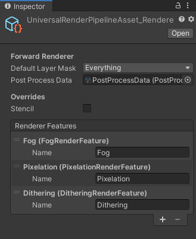
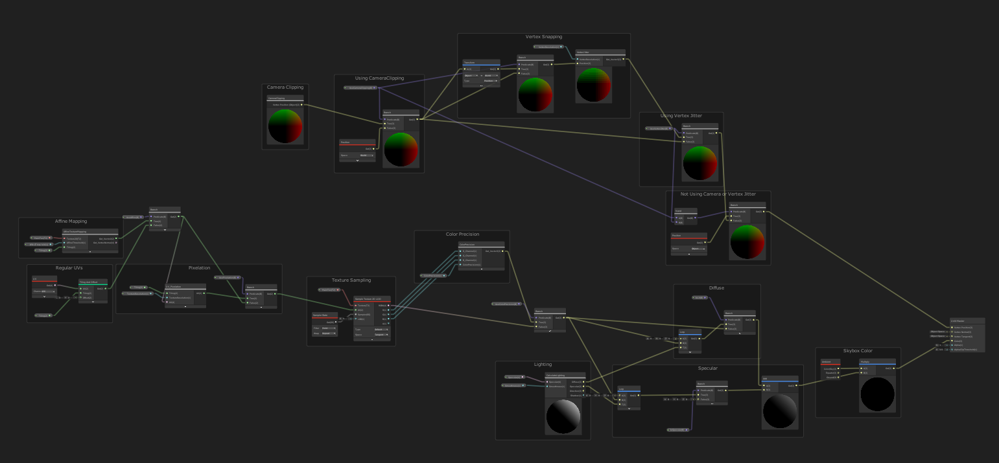

# URP-PSX-FORK (URP 14)

**Checkout [URP-11](https://github.com/Math-Man/URP-PSX-FORKED/tree/URP-11) branch for Unity 2021, URP 11 version.**

I've been using this for a short while now and really enjoying it, so I've decided to do some janitorial work on the project and add some of my own touches.

First of all I upgraded the project to work on Unity 2022.3.17f1 and URP version 14. (It was working before just printing some warnings 🙂)

I Also edited some existing shaders to stop giving warnings for Shadergraph versions above 10 (custom lighting shader for example).

### Check the [releases page](https://github.com/Math-Man/URP-PSX-FORKED/releases/tag/package) for the bundled .unitypackage file and setup instructions.

## Changes
- Upgraded for Shadergraph version 14.
- Added new render feature for CRT Effect. (Screen bending, vignette, scan lines, noise and chromatic aberration)
- Added a new unlit shader with affine texture warping and vertex locking, **unfortunately I couldn't get around to implementing custom lighting**. Anyway this shader comes in two variants:
    - A Regular version similar to original unlit shader in this project.
    - PolyBrush version which supports PolyBrush texture painting.
- Added a couple useful subgraphs, a random color picker and voronoi center graph.
- Added a variation of the PBR shader that is transparent. (Only in URP 14 branch)

#### Notes:
- In newer versions of URP depth textures needs to enabled on the Render Pipeline Asset for fog to work.
- New Affine texture warping shader currently doesn't have a lit variant and unlit variant does not support custom lighting.
- Added scenes for both new shader variants and added CRT effect to all existing scenes.

# Original Description:
## URP-PSX

Playstation 1 era retro graphics plugin optimized for Unity's Universal Rendering Pipeline with Shadergraph. The aim of this plugin was to use Unity's new pipeline to create NPR (non-photorealistic) PSX-style retro graphics with the shadergraph as the basis for materials and URP's render features as the basis for post processing effects.

#### Features

The plugin comes fully-featured with a single lit/unlit graph where you can enable/disable features according to your needs (and even modify them). I segmented every feature into a subgraph to hopefully make it easier to just plug n' play. 

#### Shadergraph:
- Lit/Unlit shader variants
- Specular Lit variant
- Camera-based vertex clipping
- Vertex snapping/Jittering
- Texture Pixelation for crushing texture resolution
- Color Precision for lower or higher color Fidelity

#### URP Render Features:
- Screen-space fog 
- Screen-space pixelation/color precision adjustments
- Screen-space dithering 

*Note: Make sure you set the render features in the pipeline asset*

#### The Graph

#### Compatibility

Unity 2019.3.7f1
Universal Rendering Pipeline/Shadergraph (7.1.8)

#### Known Issues

- Unity's Shadergraph still has a long way to go when it comes to creating NPR effects. You might experience some lighting clipping issues if you are using the PBR master node. To fix it, I tweaked some settings in the URP pipeline asset settings so they are barely noticeable. 

#### References

- [Models open-source from sketchfab](https://sketchfab.com/)
- [t-macnaga for render feature post-process](https://github.com/t-macnaga/UniversalRPPostProcessing)
- [Alex Lindman for custom lighting nodes](https://blogs.unity3d.com/2019/07/31/custom-lighting-in-shader-graph-expanding-your-graphs-in-2019/)
- [UnityRenderingExamples for render feature implementation](https://github.com/Unity-Technologies/UniversalRenderingExamples)
- [Ciro Continision for PBR master node custom lighting implementation](https://connect.unity.com/p/zelda-inspired-toon-shading-in-shadergraph)

#### License 

Open-source, use for whatever you want!!! Software is about freedom :) 

#### Support 

I developed this plugin out of passion/nostalgia for retro ps1-style horror games. But, if you found this plugin useful and want to show your support, consider sharing it,[buying me a ko-fi](https://ko-fi.com/kodrin). 
